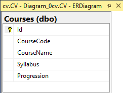

# DT207-moment1-backend

This project combines [backend code](https://github.com/RobinHawiz/DT207G-moment1-backend) from one repository and [frontend code](https://github.com/RobinHawiz/DT207G-moment1-frontend) from another to create a fullstack application. The backend and frontend are integrated using the EJS view engine, allowing everything to run through a single Express server.

---

## 📦 Deployment

Deployed on **Azure App Service**  
👉 [dt207g-moment1.azurewebsites.net](https://dt207g-moment1.azurewebsites.net)

---

## 🛠 Tech Stack

- **Node.js** / **Express**
- **JavaScript**
- **SQL Server**
- **Azure App Service** (deployment target)
- **GitHub Actions** (CI/CD pipeline)

---

## 📊 Entity Relationship Diagram

The database consists of a single `Courses` table, structured as follows:



| Column       | Type         | Description              |
|--------------|--------------|--------------------------|
| `Id`         | `INT`        | Primary key (auto-increment) |
| `CourseCode` | `NVARCHAR(6)`| Unique course identifier |
| `CourseName` | `NVARCHAR(50)`| Name of the course      |
| `Syllabus`   | `NVARCHAR(2083)`| URL to syllabus       |
| `Progression`| `CHAR(1)`    | Progression level (A/B/C) |

---

## 📡 Endpoints

### GET `/`
- Fetches all courses from the database
- Renders the homepage with course list

### POST `/`
- Deletes a course by ID (via form submission)
- Refreshes the homepage with updated list

### GET `/add-course`
- Displays a form for adding a new course

### POST `/add-course`
- Submits a new course to the database
- Redirects to the homepage on success

### GET `/about`
- Shows project info page

---

## 🧪 Running Locally

### 🧰 Prerequisites

- [Node.js](https://nodejs.org/)
- [SQL Server](https://www.microsoft.com/en-us/sql-server/sql-server-downloads)
- [SQL Server Management Studio (SSMS)](https://learn.microsoft.com/en-us/sql/ssms/download-sql-server-management-studio-ssms) to run the setup script
- Git

---

### 🔧 Step 1: Clone the project
```bash
git clone https://github.com/RobinHawiz/DT207G-moment1-backend.git
```
```bash
cd DT207G-moment1
```

---

### 📦 Step 2: Install dependencies
```bash
npm install
```

---

### 🧬 Step 3: Configure environment variables
```env
DB_USER=local
DB_PASSWORD=local
DB_NAME=cvdb
DB_HOST=YOUR_SERVER_NAME

APP_PORT=4000

CORS_ORIGIN=http://localhost:5173
```
⚠️ Make sure DB_USER and DB_PASSWORD match the credentials created in the SQL script.
This script creates a login/user local with password local and grants full access to the database.

💡 You can find your SQL Server name in SSMS under Server Name when connecting.

---

### 🏗️ Step 4: Set up the database via SSMS

- Open SQL Server Management Studio (SSMS)

- Connect to your local SQL Server instance

- Open the db/setup.sql file from this project

- Execute the script

---

### 🚀 Step 5: Run the backend server

```bash
npm start
```
Now your server will be live at http://localhost:3000

---

## 🚨 Having Trouble Connecting to the Database?

If your backend fails to connect to the SQL Server it’s likely due to SQL Server not being configured for SQL Server Authentication. SQL Server must be set to Mixed Mode Authentication (SQL + Windows) in order for user accounts like local to work.

✅ Watch this helpful tutorial to fix it:

📺 [How to Enable SQL Server Authentication (YouTube)](https://www.youtube.com/watch?v=uDS6c6DZyY4&t=397s&ab_channel=CodeandLogicMaker)
